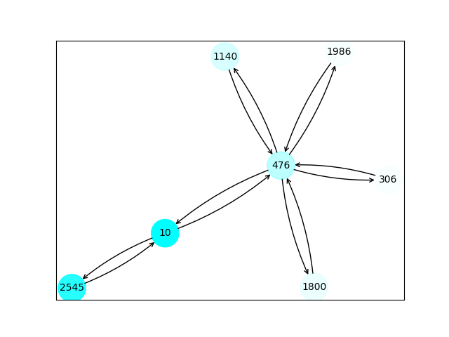
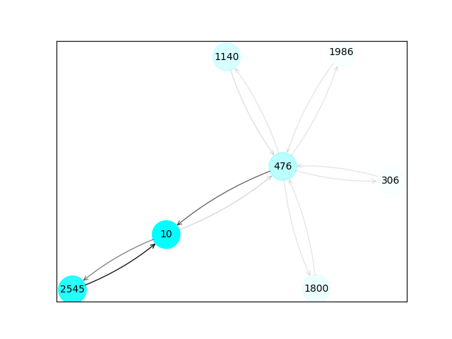

# Explaining Graph Neural Network with Captum 

In this tutorial we demonstrate how to apply feature attribution methods to graphs. Specifically, we try to find the most important nodes and edges to the model in node classification..

We use cora dataset from dgl.data. The Cora dataset used in this tutorial only consists of one single graph.


```python
# Install and import required packages.
import dgl
import torch
import torch.nn as nn
import torch.nn.functional as F
import dgl.data
from dgl.nn import GraphConv
```

## Loading Cora Dataset


```python
# The Cora dataset used in this tutorial only consists of one single graph.
dataset = dgl.data.CoraGraphDataset()
g = dataset[0]
```

    NumNodes: 2708
    NumEdges: 10556
    NumFeats: 1433
    NumClasses: 7
    NumTrainingSamples: 140
    NumValidationSamples: 500
    NumTestSamples: 1000


## Define the model
This tutorial will build a two-layer Graph Convolutional Network (GCN). Each layer computes new node representations by aggregating neighbor information. What's more, we use GraphConv which supports edge_weight as a parameter.


```python
class GCN(nn.Module):
    def __init__(self, in_feats, h_feats, num_classes):
        super(GCN, self).__init__()
        self.conv1 = GraphConv(in_feats, h_feats)
        self.conv2 = GraphConv(h_feats, num_classes)

    def forward(self, in_feat, g, edge_weight=None):
        h = self.conv1(g, in_feat, edge_weight=edge_weight)
        h = F.relu(h)
        h = self.conv2(g, h, edge_weight=edge_weight)
        return h
```

## Training the model
Training this GCN is similar to training other PyTorch neural networks.


```python
device = torch.device('cuda' if torch.cuda.is_available() else 'cpu')
model = GCN(g.ndata['feat'].shape[1], 16, dataset.num_classes).to(device)
g = g.to(device)
optimizer = torch.optim.Adam(model.parameters(), lr=0.01, weight_decay=5e-4)

features = g.ndata['feat']
labels = g.ndata['label']
train_mask = g.ndata['train_mask']

for epoch in range(1,201):
    model.train()
    optimizer.zero_grad()
    # Forward
    logits = model(features, g)
    
    # Compute prediction
    pred = logits.argmax(1)
    
    # Compute loss
    # Note that you should only compute the losses of the nodes in the training set.
    loss = F.cross_entropy(logits[train_mask], labels[train_mask])
    
    # Backward
    loss.backward()
    optimizer.step()
```


## Explaining the predictions
We use the [captum](https://captum.ai/) library for calculating the attribution values.


```python
# Select the node with index 10 for interpretability analysis
output_idx = 10
target = int(g.ndata['label'][output_idx])
print(target)
```

    0

```python
# import captum
from captum.attr import IntegratedGradients
from functools import partial

# Node explainability
ig = IntegratedGradients(partial(model.forward, g=g))
ig_attr_node = ig.attribute(g.ndata['feat'], target=target,
                            internal_batch_size=g.num_nodes(), n_steps=50)
print(ig_attr_node.shape)
```


    torch.Size([2708, 1433])

```python
# Scale attributions to [0, 1]:
ig_attr_node = ig_attr_node.abs().sum(dim=1)
ig_attr_node /= ig_attr_node.max()
```

```python
# Visualize
from utility import visualize_subgraph
import matplotlib.pyplot as plt

num_hops = 2
ax, nx_g = visualize_subgraph(g, output_idx, num_hops, node_alpha=ig_attr_node)
plt.show()
```



```python
def model_forward(edge_mask, g):
    out = model(g.ndata['feat'],g,edge_weight=edge_mask)
    return out

# Edge explainability
edge_mask = torch.ones(g.num_edges()).requires_grad_(True).to(device)
ig = IntegratedGradients(partial(model_forward, g=g))
ig_attr_edge = ig.attribute(edge_mask, target=target,
                            internal_batch_size=g.num_nodes(), n_steps=50)
print(ig_attr_edge.shape)
```


    torch.Size([10556])

```python
# Scale attributions to [0, 1]:
ig_attr_edge = ig_attr_edge.abs()
ig_attr_edge /= ig_attr_edge.max()
```


```python
# Visualize
ax, nx_g = visualize_subgraph(g, output_idx, num_hops, edge_alpha=ig_attr_edge)
plt.show()
```


```python
# Visualize node and edge explainability
ax, nx_g = visualize_subgraph(g, output_idx, num_hops, node_alpha=ig_attr_node, edge_alpha=ig_attr_edge)
plt.show()
```


****

## To Do List

**Problems:**

- make a heatmap plot for visualizing the subgraph.
- the value of ig_attr_node and ig_attr_edge still to be something wrong.

